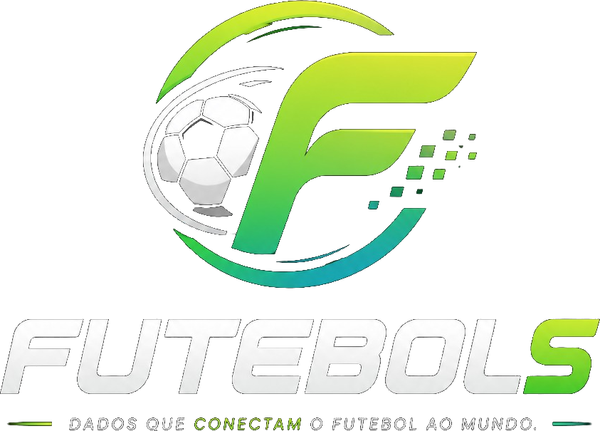

# SDK de Esportes - Futebols

<p align="center">
  
</p>

<p align="center">
  Integre dados de jogos, campeonatos e placares no seu app Android de forma simples.
</p>

<p align="center">
  <a href="https://futebols.com.br/" target="_blank"><strong>Acessar fornecedor da API (Futebols)</strong></a>
</p>

<p align="center">
  <a href="https://documenter.getpostman.com/view/8125887/2sB2qWHQLS#baaf4a18-cd83-4ca6-854f-b70c555e616e" target="_blank">
    
  </a>
</p>

<p align="center">
  <a href="https://wa.me/5516997141457?text=Ol%C3%A1%2C%20preciso%20de%20ajuda%20com%20SDK%20de%20esportes%20futebols.com.br." target="_blank">
    
  </a>
</p>

> Suporte via WhatsApp configurado no botao acima.

---

## O que e este repositorio?

Este projeto e um **SDK Android** (modulo de biblioteca) para exibir:

- lista de campeonatos;
- lista de jogos;
- status da partida (ao vivo, encerrado, etc.);
- placares e logos dos times;
- filtros por data e campeonato.

Em resumo: ele facilita colocar uma tela de esportes pronta dentro do seu app.

---

## Para quem serve?

- Apps Android e Android TV que querem mostrar jogos e campeonatos.
- Equipes que ja possuem token de acesso da API Futebols.
- Projetos que desejam cache local para melhor performance.

---

## Como funciona (explicacao simples)

1. Seu app salva um token.
2. A tela `ActivityEsporte` e aberta.
3. O SDK consulta a API da Futebols.
4. Os dados sao salvos localmente (Room/SQLite).
5. A interface mostra campeonatos e jogos para o usuario.

---

## Endpoints utilizados

Base da API utilizada pelo SDK:

`https://api.futebols.com.br/api/`

Rotas consumidas:

- `GET /api/campeonatos`
- `GET /api/jogos`

Autenticacao:

- Header: `Authorization: Bearer SEU_TOKEN`

---

## Como usar no seu projeto Android

## 1) Requisitos

- Android Studio atualizado
- `minSdk 21+`
- token valido da Futebols

## 2) Salvar token antes de abrir a tela

O SDK le o token do `SharedPreferences`:

- arquivo: `ApiEsporteBrPrefs`
- chave: `token`

Exemplo:

```java
SharedPreferences prefs = context.getSharedPreferences("ApiEsporteBrPrefs", Context.MODE_PRIVATE);
prefs.edit().putString("token", "SEU_TOKEN_AQUI").apply();
```

## 3) Abrir a tela de esportes

Inicie a activity:

`com.diegodev.apidesportes.jogos.ActivityEsporte`

## 4) Build

No terminal, dentro de `api_esportes`:

```bash
./gradlew :app:assembleDebug
```

No Windows (PowerShell):

```powershell
.\gradlew.bat :app:assembleDebug
```

---

## Estrutura principal (resumida)

- `jogos/ActivityEsporte.java`: tela principal
- `jogos/response/`: chamadas de API
- `jogos/interfac/`: interfaces Retrofit
- `jogos/bancoSql/`: banco local Room
- `cpp/api_esportes.cpp`: protecao/ofuscacao da URL base

---

## Observacoes importantes

- Se o token estiver invalido ou vazio, a tela encerra.
- O SDK depende da biblioteca nativa `api_esportes` (JNI).
- Recomendado testar em rede real e com token ativo.

---

## Fornecedor da API

- Site/Login: [https://futebols.com.br/](https://futebols.com.br/)
- Documentacao da API: [Postman - Futebol API api.futebols.com.br](https://documenter.getpostman.com/view/8125887/2sB2qWHQLS#baaf4a18-cd83-4ca6-854f-b70c555e616e)
- No painel, copie seu token em **Sistema -> Meus Dados**.

---

## Suporte rapido via WhatsApp

Clique no botao no topo do README para abrir conversa com a mensagem pronta:

`Ola, preciso de ajuda com SDK de esportes futebols.com.br.`

