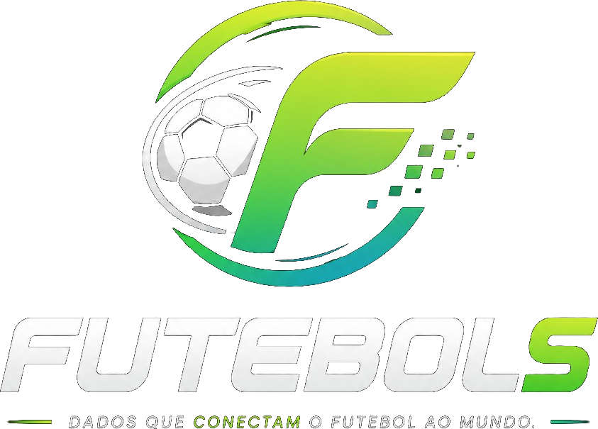

# SDK de Esportes - Futebols

<p align="center">
  
</p>

<p align="center">
  Integre dados de jogos, campeonatos e placares no seu app Android de forma simples.
</p>

<p align="center">
  <a href="https://futebols.com.br/" target="_blank"><strong>Acessar fornecedor da API (Futebols)</strong></a>
</p>

<p align="center">
  <a href="https://documenter.getpostman.com/view/8125887/2sB2qWHQLS#baaf4a18-cd83-4ca6-854f-b70c555e616e" target="_blank">
    
  </a>
</p>

<p align="center">
  <a href="https://wa.me/5516997141457?text=Ol%C3%A1%2C%20preciso%20de%20ajuda%20com%20SDK%20de%20esportes%20futebols.com.br." target="_blank">
    
  </a>
</p>

> Suporte via WhatsApp configurado no botao acima.

---

## Documentacao — Indice

Guia principal para desenvolvedores, clientes e mantenedores do SDK:

### Para quem consome o SDK (clientes)

- **[Event Listener — Integracao com o app consumidor](docs/EVENT_LISTENER.md)**
  Acompanhe os cliques nos jogos dentro do SDK e receba os dados de transmissao
  (`canais_links`) para reproduzir no seu proprio player.
- **[Canais de Transmissao](docs/CANAIS_TRANSMISSAO.md)**
  Como funcionam a faixa de canais na lista e os modais de canais (Links, Simples, TV, IA).
- **[Tabela de Classificacao](docs/CLASSIFICACAO.md)**
  Como funciona a opcao "Tabela" (classificacao por campeonato).

### Para quem mantem o SDK (manutencao/continuidade)

- **[AGENTS.md](docs/AGENTS.md)** — contexto completo do projeto, estrutura,
  build, teste em aparelhos e estado atual da ultima sessao.
- **[Documentacao da API Futebols (Postman)](https://documenter.getpostman.com/view/8125887/2sB2qWHQLS#baaf4a18-cd83-4ca6-854f-b70c555e616e)**
  Referencia dos endpoints utilizados pelo SDK.

---

## O que e este repositorio?

Este projeto e um **SDK Android** (modulo de biblioteca) para exibir:

- lista de campeonatos;
- lista de jogos;
- status da partida (ao vivo, encerrado, etc.);
- placares e logos dos times;
- filtros por data e campeonato;
- canais de transmissao de cada jogo (faixa de chips na lista + modal);
- tabela de classificacao dos campeonatos;
- **evento de clique (Event Listener)** para o app consumidor acompanhar os
  jogos clicados e reproduzir com os dados de transmissao (`canais_links`).

Em resumo: ele facilita colocar uma tela de esportes pronta dentro do seu app.

---

## Para quem serve?

- Apps Android e Android TV que querem mostrar jogos e campeonatos.
- Equipes que ja possuem token de acesso da API Futebols.
- Projetos que desejam cache local para melhor performance.

---

## Como funciona (explicacao simples)

1. Seu app salva um token.
2. A tela `ActivityEsporte` e aberta.
3. O SDK consulta a API da Futebols.
4. Os dados sao salvos localmente (Room/SQLite).
5. A interface mostra campeonatos e jogos para o usuario.

---

## Endpoints utilizados

Base da API utilizada pelo SDK:

`https://api.futebols.com.br/api/`

Rotas consumidas:

- `GET /api/campeonatos`
- `GET /api/jogos`
- `GET /api/campeonato/{id}/classificacao`

Autenticacao:

- Header: `Authorization: Bearer SEU_TOKEN`

---

## Configuracao pratica do dominio da API

Agora o SDK permite configurar o dominio/base da API sem editar codigo Java/C++.

Prioridade de uso da URL:

1. `API_BASE_URL` definida no build (gradle.properties ou variavel de ambiente).
2. URL nativa/ofuscada do SDK (fallback atual).
3. Fallback final interno: `https://api.futebols.com.br/api/`

### Opcao 1 - `gradle.properties` (recomendado)

No `gradle.properties` do projeto consumidor, adicione:

```properties
API_BASE_URL=https://api.futebols.com.br/api/
```

### Opcao 2 - variavel de ambiente (CI/CD)

Defina a variavel antes do build:

```bash
export API_BASE_URL=https://api.futebols.com.br/api/
```

No Windows PowerShell:

```powershell
$env:API_BASE_URL="https://api.futebols.com.br/api/"
```

Observacoes:

- Sempre informe com `http(s)` e preferencialmente terminando com `/`.
- Exemplo para outro ambiente: `https://homolog.api.futebols.com.br/api/`

---

## Como usar no seu projeto Android

### Passo 1 — Adicionar o repositorio JitPack

O SDK e compilado automaticamente pelo **JitPack** a partir das **tags** deste
repositorio (`https://github.com/jaderesp/api_esportes`). Por isso, o primeiro
passo e informar o repositorio do JitPack ao Gradle.

No `settings.gradle` / `settings.gradle.kts` (raiz do projeto):

```groovy
dependencyResolutionManagement {
    repositories {
        maven { url 'https://jitpack.io' }
    }
}
```

> Projetos com Gradle antigo podem configurar em
> `allprojects { repositories { maven { url 'https://jitpack.io' } } }`.

### Passo 2 — Adicionar a dependencia

## Aviso importante: mudanca de repositorio (GitHub/JitPack)

> **Atencao:** o repositorio oficial deste SDK foi migrado.
>
> - Repositorio antigo: [https://github.com/DevXoneTv/api_esportes](https://github.com/DevXoneTv/api_esportes)
> - Repositorio atual: [https://github.com/jaderesp/api_esportes](https://github.com/jaderesp/api_esportes)

Se sua dependencia ainda usa `com.github.DevXoneTv`, ela esta apontando para o repositorio antigo.
Como o projeto usa **JitPack**, voce precisa trocar o dono/repositorio na dependencia para buscar novas versoes no local correto.

Onde alterar essa dependencia:

- Projeto Android com **Groovy**: arquivo `app/build.gradle` (ou modulo onde o SDK e usado).
- Projeto Android com **Kotlin DSL**: arquivo `app/build.gradle.kts` (ou modulo onde o SDK e usado).
- A alteracao deve ser feita dentro do bloco `dependencies { ... }`.

Dependencia antiga:

```groovy
dependencies {
    implementation 'com.github.DevXoneTv:api_esportes:1.0'
}
```

Dependencia atualizada (Groovy):

```groovy
dependencies {
    implementation 'com.github.jaderesp:api_esportes:1.2'
}
```

Dependencia atualizada (Kotlin DSL):

```kotlin
dependencies {
    implementation("com.github.jaderesp:api_esportes:1.2")
}
```

### Passo 3 — Salvar token e abrir a tela

Veja as secoes **"Salvar token antes de abrir a tela"** e **"Abrir a tela de esportes"** abaixo.

### Passo 4 — Escutar o clique nos jogos (Event Listener) *(opcional)*

Quer que o seu app seja **avisado quando o usuario clicar em um jogo** dentro do
SDK, recebendo o jogo completo com os canais de `canais_links`
(incluindo a `transmission_url`) para **reproduzir no seu proprio player**?

Registre um listener **antes** de abrir a `ActivityEsporte`:

```java
EsporteEventListener.setListener(jogo -> {
    // jogo.getCanaisLinks() → List<ItemCanalLink> com nome, logo, servidor e URL
});
```

Guia completo (fluxo, payload, exemplos Java/Kotlin, limpeza) em
[`docs/EVENT_LISTENER.md`](docs/EVENT_LISTENER.md).

---

## Como receber atualizacoes do SDK (tags e versoes)

Cada versao publicada e uma **tag** no repositorio (ex.: `1.0`, `1.1`, `1.2`).
O JitPack compila a biblioteca a partir da tag indicada no final da dependencia
— por isso, **e obrigatorio atualizar a versao** para receber novas
funcionalidades e correcoes.

Para atualizar o SDK no seu app:

1. Consulte a versao mais recente em **Releases/Tags** do repositorio:
   `https://github.com/jaderesp/api_esportes/releases` (a versao mais alta = mais recente).
2. No arquivo de dependencias (Groovy ou Kotlin DSL), troque o numero no final
   da dependencia (ex.: de `1.1` para `1.2`).
3. Clique em `Sync Now` no Android Studio.
4. Faca o build e publique o app normalmente.

> Toda novidade de layout/funcionalidade e entregue quando o cliente sobe a
> versao da dependencia — nao e preciso mexer no codigo do app.

### Novidades por versao

**1.2** (atual):

- **Event Listener:** o SDK emite eventos para o app consumidor:
  quando o usuario clica na **linha de um jogo**, entrega o jogo completo com
  todos os canais de `canais_links` (nome, logo, servidor e `transmission_url`) via
  `EsporteEventListener.setListener(...)`. E quando o usuario clica em um **canal**
  dentro do modal de canais, entrega o **`stream_id`** (int) via
  `EsporteEventListener.definirAoClicarNoCanalListener(...)` (callback com retorno
  `boolean`: `true` = o app consumiu o clique). Registro **antes** de abrir a
  `ActivityEsporte` (callback na thread principal; use `clear()` quando nao
  precisar mais). Clientes sem listener nao mudam de comportamento. Detalhes em
  `docs/EVENT_LISTENER.md`.
- **Canais de transmissao:** cada jogo com `canais_links` mostra uma **faixa de
  chips** (logotipo + nome) abaixo da linha; clicar na linha abre o **modal** com
  todas as secoes (Links, Simples, TV, IA) e clicar em um chip abre os
  **detalhes do canal** (logo, servidor e URL de transmissao). Detalhes em `docs/CANAIS_TRANSMISSAO.md`.
- **Tabela de classificacao:** ao selecionar um campeonato, aparece a opcao "Tabela" acima de "HOJE" exibindo a classificacao completa. Detalhes em `docs/CLASSIFICACAO.md`.
- Novo modulo `demo/` para testes em aparelho real/TV. O token de testes e
  injetado no build pela variavel de ambiente `FUTEBOLS_TOKEN`
  (ex.: `$env:FUTEBOLS_TOKEN="SEU_TOKEN"; .\gradlew.bat :demo:assembleDebug` no
  Windows) — **nunca** versione o token no repositorio; sem a variavel o campo
  de token abre em branco para colagem manual.

## 1) Requisitos

- Android Studio atualizado
- `minSdk 21+`
- token valido da Futebols

## 2) Salvar token antes de abrir a tela

O SDK le o token do `SharedPreferences`:

- arquivo: `ApiEsporteBrPrefs`
- chave: `token`

Exemplo:

```java
SharedPreferences prefs = context.getSharedPreferences("ApiEsporteBrPrefs", Context.MODE_PRIVATE);
prefs.edit().putString("token", "SEU_TOKEN_AQUI").apply();
```

## 3) Abrir a tela de esportes

Inicie a activity:

`com.diegodev.apidesportes.jogos.ActivityEsporte`

## 4) Build

No terminal, dentro de `api_esportes`:

```bash
./gradlew :app:assembleDebug
```

No Windows (PowerShell):

```powershell
.\gradlew.bat :app:assembleDebug
```

---

## Estrutura principal (resumida)

- `jogos/ActivityEsporte.java`: tela principal
- `jogos/response/`: chamadas de API
- `jogos/interfac/`: interfaces Retrofit
- `jogos/bancoSql/`: banco local Room
- `cpp/api_esportes.cpp`: protecao/ofuscacao da URL base

---

## Observacoes importantes

- Se o token estiver invalido ou vazio, a tela encerra.
- O SDK depende da biblioteca nativa `api_esportes` (JNI).
- Recomendado testar em rede real e com token ativo.

---

## Fornecedor da API

- Site/Login: [https://futebols.com.br/](https://futebols.com.br/)
- Documentacao da API: [Postman - Futebol API api.futebols.com.br](https://documenter.getpostman.com/view/8125887/2sB2qWHQLS#baaf4a18-cd83-4ca6-854f-b70c555e616e)
- No painel, copie seu token em **Sistema -> Meus Dados**.

---

## Suporte rapido via WhatsApp

Clique no botao no topo do README para abrir conversa com a mensagem pronta:

`Ola, preciso de ajuda com SDK de esportes futebols.com.br.`

